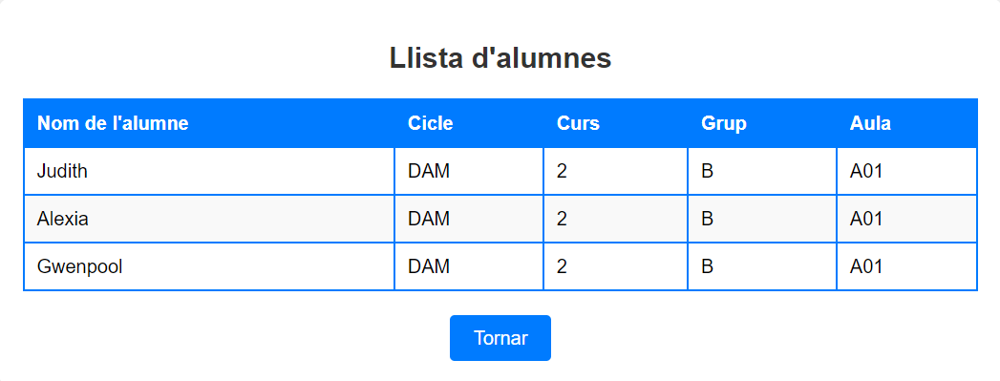

14/10/2024
He començat a fer la pràctica, per el primer apartat de modificar l'API de la pràctica anterior i canviar eljavascript proporcionat per el professor (Toni).
He aconseguit canviar certs aspectes tal i com demanava la pràctica, però hi tinc un problema que no entenc, em surt el que es demana, però no amb la informació correcta:
[
  {
    "NomAlumne": "s",
    "Cicle": "t",
    "Curs": "a",
    "Grup": "t",
    "DescAula": "u"
  },
  {
    "NomAlumne": "m",
    "Cicle": "e",
    "Curs": "s",
    "Grup": "s",
    "DescAula": "a"
  }
]

En lloc d'aquestes lletres, m'hauria de sortir els alumnes i la seva info que tinc a la base de dades Alumnat.
El que hauria de sortir-me (segons el que tinc a la base de dades alumnat i a la taula alumne), seria quelcom similar a això:
[
  {
    "NomAlumne": "Judith",
    "Cicle": "DAM",
    "Curs": "2",
    "Grup": "B",
    "DescAula": "A01"
  },
  {
    "NomAlumne": "Alexia",
    "Cicle": "DAM",
    "Curs": "2",
    "Grup": "B",
    "DescAula": "A01"
  },
  {
    "NomAlumne": "Gwenpool",
    "Cicle": "DAM",
    "Curs": "2",
    "Grup": "B",
    "DescAula": "A01"
  }
]

Espero solucionar aquest problema quan abans possible, per poder continuar bé amb la pràctica.

15/10/2024
Segueixo sense solucionar el problema mencionat anteriorment (encara que ho he barallat, no em funciona).

16/10/2024
Segueixo probant coses i encara no se m'ha solucionat el problema (ho he barallat un altre cop).

17/10/2024
He aconseguit resoldre el problema, i així és com queda la llista d'alumnes a l'html:

He intentat fer l'apartat 2, però no estic del tot segura de com fer-lo i qué fer per a que em funcioni bé.
Espero resoldre aquest apartat i fer el tercer per a completar la pràctica del tot.

18/10/2024
He aconseguit resoldre l'apartat 2.