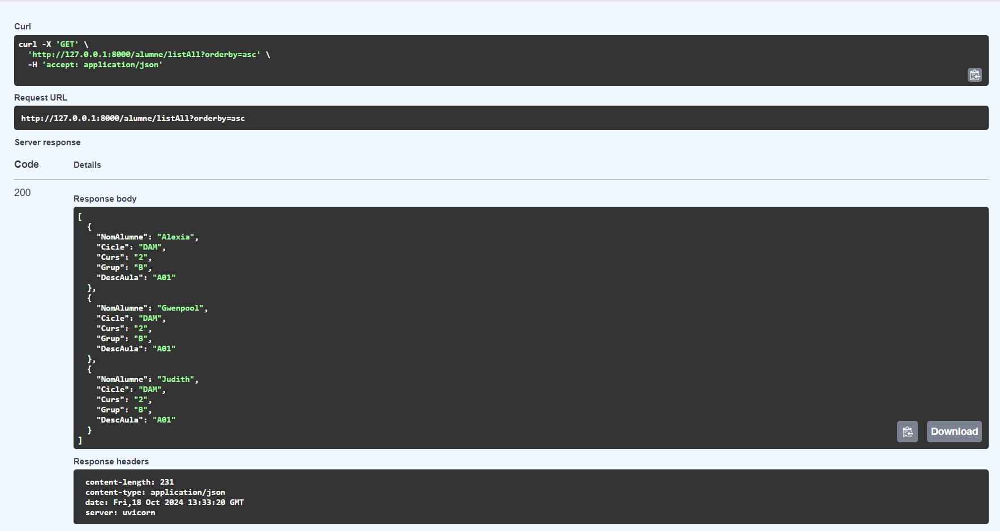
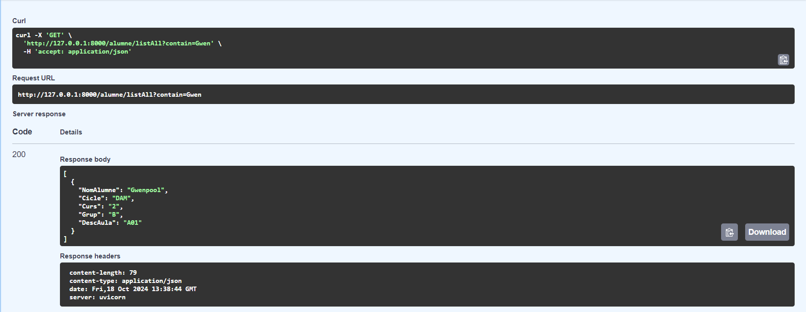
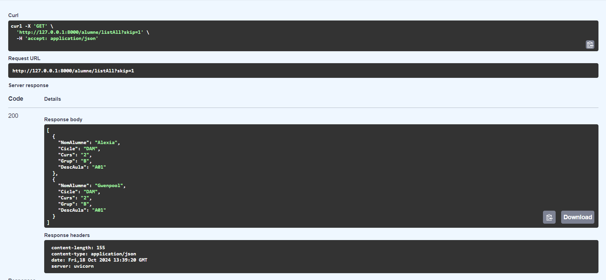
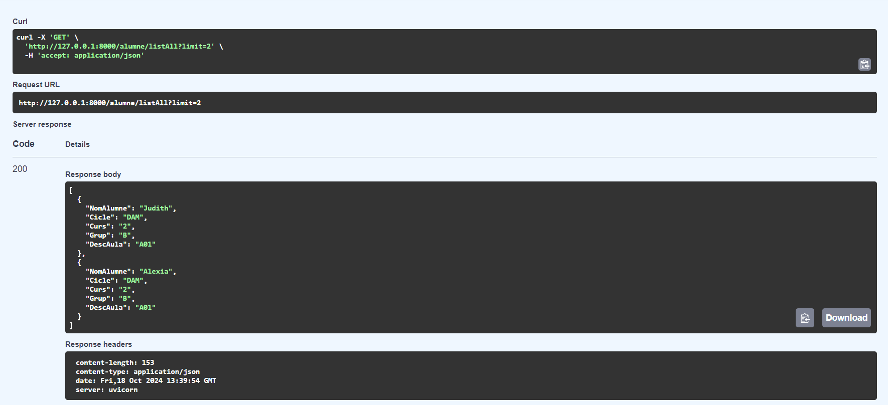
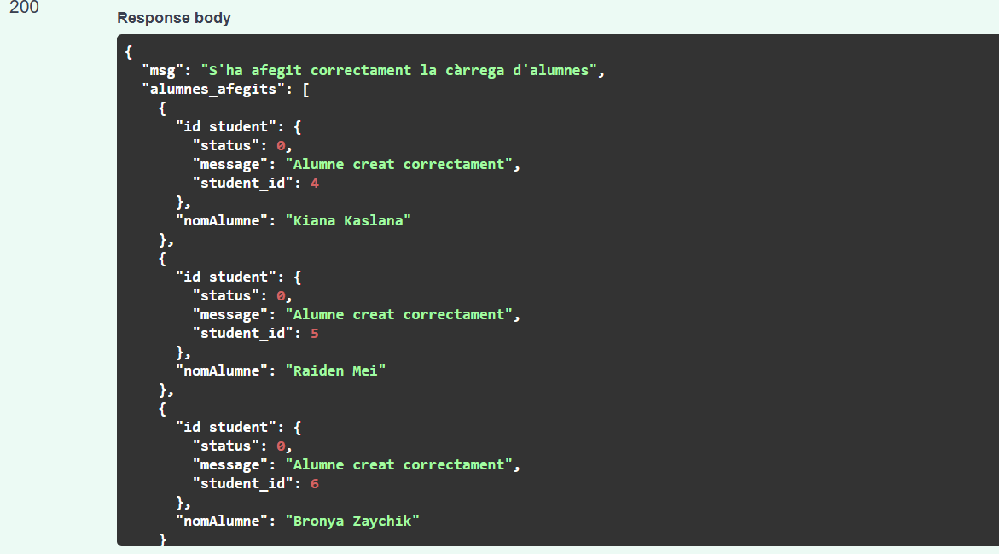
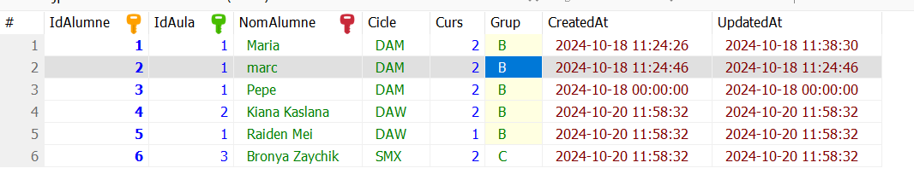

14/10/2024
He començat a fer la pràctica, per el primer apartat de modificar l'API de la pràctica anterior i canviar eljavascript proporcionat per el professor (Toni).
He aconseguit canviar certs aspectes tal i com demanava la pràctica, però hi tinc un problema que no entenc, em surt el que es demana, però no amb la informació correcta:
[
  {
    "NomAlumne": "s",
    "Cicle": "t",
    "Curs": "a",
    "Grup": "t",
    "DescAula": "u"
  },
  {
    "NomAlumne": "m",
    "Cicle": "e",
    "Curs": "s",
    "Grup": "s",
    "DescAula": "a"
  }
]

En lloc d'aquestes lletres, m'hauria de sortir els alumnes i la seva info que tinc a la base de dades Alumnat.
El que hauria de sortir-me (segons el que tinc a la base de dades alumnat i a la taula alumne), seria quelcom similar a això:
[
  {
    "NomAlumne": "Judith",
    "Cicle": "DAM",
    "Curs": "2",
    "Grup": "B",
    "DescAula": "A01"
  },
  {
    "NomAlumne": "Alexia",
    "Cicle": "DAM",
    "Curs": "2",
    "Grup": "B",
    "DescAula": "A01"
  },
  {
    "NomAlumne": "Gwenpool",
    "Cicle": "DAM",
    "Curs": "2",
    "Grup": "B",
    "DescAula": "A01"
  }
]

Espero solucionar aquest problema quan abans possible, per poder continuar bé amb la pràctica.

15/10/2024
Segueixo sense solucionar el problema mencionat anteriorment (encara que ho he barallat, no em funciona).

16/10/2024
Segueixo probant coses i encara no se m'ha solucionat el problema (ho he barallat un altre cop).

17/10/2024
He aconseguit resoldre el problema, i així és com queda la llista d'alumnes a l'html:

Com es pot veure a la imatge, mostra els alumnes, cadascun amb el seu nom, cicle, curs, grup i aula.

He intentat fer l'apartat 2, però no estic del tot segura de com fer-lo i qué fer per a que em funcioni bé.
Espero resoldre aquest apartat i fer el tercer per a completar la pràctica del tot.

18/10/2024
He aconseguit resoldre l'apartat 2. Aquests són els resultats:

1) asc:

Com es pot veure, aqui he ordenat els alumnes amb la seva informació per ordre ascendent.

2) desc:

Com es pot veure, aqui he ordenat els alumnes amb la seva informació per ordre descendent.

3) contain:

Com es pot veure, aqui he buscat que contingui "Gwen" i per tant em surten els resultats que contenen el que he indicat.

4) skip:

Com es pot veure, aqui he fet que salti la primera alumne, i per tant apareixen les dues següents.

5) limit:

Com es pot veure, aqui he posat un límit de 2 per a que només m'apareguin dos alumnes, per tant aquí només apareixen les dues primeres alumnes que he posat.

16:16
He començat a realitzar l'apartat 3 de la pràctica, el que he posat no és del tot correcte, perquè ho he agafat d'un altre mòdul que ja tenia per fer el post, així que l'he de canviar tot i fins ara he estat investigant com resoldre-ho.

19/10/2024
He seguit avançant l'apartat 3, no sé exactament com fer que comprovi si un alumne existeix o no a la base de dades, però espero resoldre-ho aviat i solucionar tot per a completar l'apartat 3 i acabar la pràctica del tot.

20/10/2024
He aconseguit acabar l'apartat 3, i encara que a mi no em funciona en el meu ordinador, l'execució correcta és aquesta:

Que, com es pot comprovar, el que he fet amb loadAlumnes és afegir una càrrega d'alumnes amb la seva informació a la base de dades:

Amb tot això, dono com acabada i completada la pràctica 2 de FastAPI.